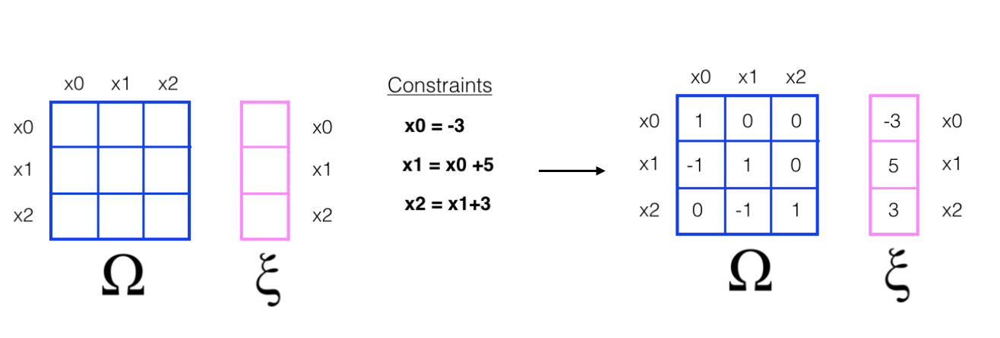

# S.L.A.M.

The SLAM algorithm, which stands for Simultaneous Location and Mapping, is the foundational computer vision task for self-driving automobiles. For the capstone project in the <strong>Udacity-Nvidia Computer Vision Nanodegree</strong> (<a href='https://www.udacity.com/course/self-driving-car-engineer-nanodegree--nd013'>see details</a>), students were tasked to write and implement their own version of the Slam algorithm.  The criteria of the project required the construction of a Robot class, a member method to move the robot, and a member method to sense the robot's surroundings, and a data structure which could store and represent the robot's movement.  

The files in this repository are: <ul><li>an <em>iPython notebook</em> containing the project's execution and implementation</li> <li>a Python file defining the Robot class</li> <li>a Python file defining helper functions to visualize the final data structure</li> <li>and a folder which stores images referenced in the notebook.</li></ul>  

The crux of the Slam algorithim as implemented in this repository is a mu calculation of a constraint matrix, called Omega, and a vector, called Xi.  Together, Omega and Xi store the information that defines the constraining relationships between the robot's sense measurements.  By collecting a series of measurements between itself and a set of randomly placed landmarks in a 2D world, the robot autonomously tracks and maps its location.  The premise from which the Slam algorithim generates its constraining data structures is the principle of Bayesian Inference, which calculates updated probability distributions informed by more recent measurement.

